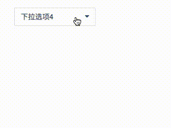
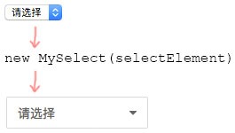

题目：实现一个下拉菜单
========================

实现一个自定义下拉菜单 `MySelect`。



`MySelect` 接受一个 Select 元素作为参数，使用这个 Select 元素上的属性和&lt;option&gt;作为自定义下拉菜单的属性，并替换这个 Select 元素。

假如存在这样的 Select 元素:

```html
<select id="city">
    <option value="shanghai" selected>上海</option>
    <option value="beijing">北京</option>
    <option value="guangzhou">广州</option>
</select>
```

则这样实例化自定义下拉菜单：

```js
var selectElement = document.getElementById('city')
var mySelect = new MySelect(selectElement)
mySelect.on('change', function (event) {
    // event.target.value === mySelect.value === this.value
})
```




----------

附加题：支持 `<optgroup>`


